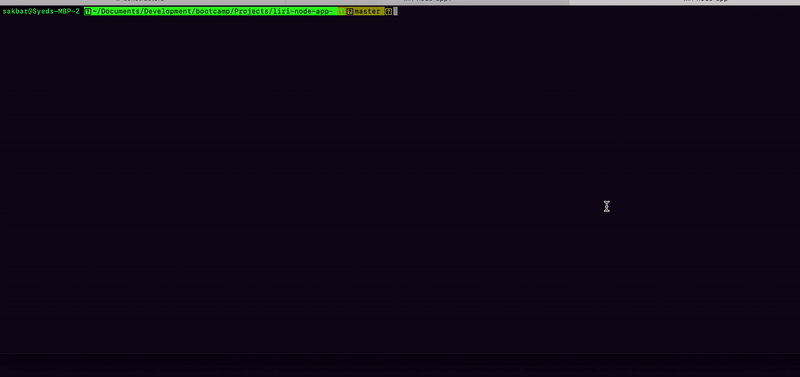

# liri-node-app
- - -

## ABOUT THE APP
LIRI is a Language Interpretation and Recognition Interface. LIRI is a command line node app that takes in parameters and gives back data. The user has the option of using four commands (listed below) in conjuntion with specific parameters associated with the commands. The  `Commands` are:

   * `concert-this`
   * `spotify-this-song`
   * `movie-this`
   * `do-what-it-says`

- - -
## HOW TO USE LIRI

### **Step by Step instructions**

1. Open terminal.
2. Navigate to the folder that contains the `liri.js` file. 
3. Run  `liri.js` as `node liri.js` and the application should ask you to select a command.
4. Once you selected the command the app will ask you to enter appropriate value for the selected command.
5. Hit enter after entering value (for option 4 no need to enter any value)

Please see the demo below:

    
- - -

## TECHNOLOGIES USED
* Javascript
* Nodejs
* Node packages:
    * Node-Spotify-API
    * Request
    * DotEnv
    * pad
    * inquirer
    * colors
    * fs
* APIs used:
    * Bands in Town
    * OMDB
